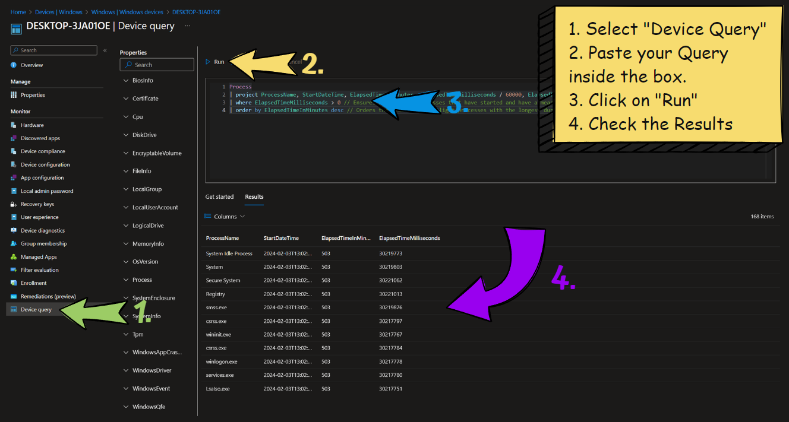

# Intune Device Query - KQL Queries

  

    
    
    
  

# Overview

This repository contains a comprehensive collection of KQL (Kusto Query Language) queries specifically designed for Microsoft Intune Device Query. These queries are ready to use and cover various aspects of device management, monitoring, and troubleshooting.

You can find more KQL Queries here -> [KQLSearch.com](https://www.KQLSearch.com)

# Categories

- **System Information**

  - BIOS Details
  - CPU Information
  - Disk Drive Details
  - Logical Drive Information

- **Security & Certificates**

  - Certificate Management
  - Windows Security Events
  - Driver Signature Verification
  - User Access & Permissions

- **Process & Performance**

  - Process Monitoring
  - Memory Usage Analysis
  - Disk I/O Tracking
  - CPU Performance

- **Windows Events**

  - Application Crashes
  - System Events
  - Security Auditing
  - Service Status

- **Registry & Configuration**
  - Startup Programs
  - Registry Analysis
  - System Configuration

# What is Device Query in Intune?

Device query allows you to quickly gain on-demand information about the state of your devices. When you enter a query on a selected device, Device query runs a query in real time. The data returned can then be used to respond to security threats, troubleshoot the device, or make business decisions.

Details:

Device Query -> [Device Query](https://learn.microsoft.com/en-us/mem/analytics/device-query)

Data Platform Schema -> [Data Platform Schema](https://learn.microsoft.com/en-us/mem/analytics/data-platform-schema)

# Requirements

- License:
  - The Intune Advanced Analytics Add-on OR
  - Microsoft Intune Suite
- The Windows Device has to be running and connected to the Internet.
- To use Device query on a device, the device must be enrolled in Endpoint Analytics.
- To use Device query, devices must be Intune managed and corporate owned.
- For a user to use Device query, you must assign the Managed Devices - Query permission to them.

# How to use the queries in Intune

# Contributing

Create a Issue or Pull Request if you want to add a new query or have a idea for one that could be useful for everyone.

Feel free to fork the repository and submit pull requests. For major changes, please open an issue first to discuss what you would like to change.

# License

This project is licensed under the MIT License - see the [LICENSE](LICENSE) file for details.

# Acknowledgments

- Microsoft Intune Documentation
- Community Contributors
- Microsoft Tech Community

---

Made with ❤️ by [Ugur Koc](https://github.com/ugurkocde)
